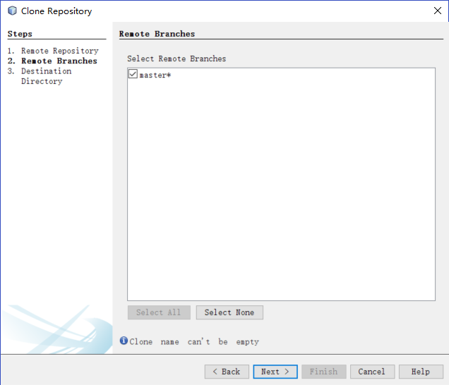

# ハンズオン手順概要

### DEVCSのgitリポジトリからリソースをローカルにダウンロードする  
NetBeans を開いて、Team > Git > Cloneを選択

Clone Repository設定画面で以下の値を入力します。
  ➖Repository URL: 別紙にてご案内した文字列を入力してください
  ➖User: 別紙にてご案内した文字列を入力してください
  ➖Password: 別紙にてご案内した文字列を入力してください
  ➖Save Password: チェックオンにする

### 自動デプロイ用のシェルスクリプトを作成する  
+ 左ペインの表示をProjectからFileに変更する
  

+ shフォルダに別途にてご配布した下記ファイルを追加する
  

+ シェルファイル
  

+ デプロイオプションを定義するJSONファイル
  

+ SQLファイル（テーブル削除（存在すれば）、テーブル作成、データ導入用）
  

+ ローカルリポジトリにコミットする
  EmployeeRESTAppを右クリック > Git > コミット
  
  

+ リモート(DEVCS)リポジトリにプッシュする
  EmployeeRESTAppを右クリック > Git > リモート > プッシュ
  
  
  
  

+ DEVCSで新しくコッミトしたリソースを確認する
  

### ブランチ及びタグを切る  
+ Git リポジトリ・ブラウザ > firstdemo > 分岐 > ローカル > masterを右クリック > 分岐の作成
  

  Create Branch画面で以下の値を入力します。
  ➖Branch Name: v1.0.0
  

+ リモート(DEVCS)リポジトリにプッシュする
  Git リポジトリ・ブラウザ  > firstdemoを右クリック > リモート > プッシュ
  
  
  
  
  

+ DEVCSでブラントを確認する
  

+ Git リポジトリ・ブラウザ  > 分岐 > ローカル > v1.0.0を右クリック > タグの作成
  
  Create Tag画面で以下の値を入力します。
  ➖Tag Name: v1.0.0-ST
  ➖Revision: v1.0.0

  

+ リモート(DEVCS)リポジトリにプッシュする
  Git リポジトリ・ブラウザ  > firstdemoを右クリック > リモート > プッシュ
  
  
  
  

+ DEVCSでタグを確認する
  

### DEVCSでリソースをビルドする  
+ DEVCSのメニューからBuildを選択し、New Jobボタンをクリックする
  

+ 名前を入力する

  ➖Job Name:FirstDemoJob

+ ビルド手順は下図によって設定する

    Mainタブを選択し、下記の値を入力します。
    ➖Name:FirstDemoJob
    ➖JDK:JDK8
    

    BuildParametersタブには何も入力しません。
    

    Source Controlタブを選択し、下記の値を入力します。
    ➖Source Control Option: Git
    ➖Repository: firstdemo.git
    ➖Name: origin
    ➖Reference Spec: +refs/heads/\*:refs/remotes/origin/\*
    ➖Branches: v1.0.0

    

    Triggersタブを選択し、下記の値を入力します。
    ➖Based on SCM polling scheduleをチェックする
    

    Environmentタブには何も入力しません。
    

    Build Stepタブを選択し、Add Build Stepをクリックし、invoke Maven 3を追加します。
    

    invoke Maven 3のオプションをそのままにします。
    

    同じく、Add Build Stepをクリックし、Excute Shellを追加し、commandに下記を入力します。
    cd sh
    chmod 777 deploy.sh
    ./deploy.sh

    

    同じく、Add Build Stepをクリックし、invoke SQLclを追加します。
    

    Invoke SQLclに下記を入力します。
    ➖Username: 別紙にてご案内した文字列を入力してください
    ➖Password: 別紙にてご案内した文字列を入力してください
    ➖Connect String: 別紙にてご案内した文字列を入力してください
    ➖SQL File Path: ./sh/DBDataImport.sql
    

    Post Buildタブを選択し、下記の値を入力します。
    ➖Archive the artifactsをチェックする
    ➖Files To Archive: target/EmployeeRESTApp-1.0-dist.zip
    

    Advancedタブには何も入力しません。
    

    Saveを押して設定内容を保存する。
    
+ 「Build Now」ボタンをクリックする(ACCSインスタンを新規作成して，プロジェクトをデプロイメントする)
  
  

+ 出力ログを確認する
  
  

+ DBテーブルを削除して（存在すれば）、新テーブルを作って、データを導入する
  

+ ビルド後の状態確認
  

### 作成したACCSインスタンスを確認する
+ ACCS作成時間とプロジェクトデプロイメント時間は同じ
  
  
  

+ デプロイメントプロジェクトを確認する
  
  
  

### DEVCSにISSUEを登録する
  

New Issue画面で下記の値を入力します。
➖Summary: 画面表示不正
➖Description: http://127.0.0.1:8080/テキストボックス表示が不正。削除してください。
➖Release: 0.0.1
➖Owner: Cloud Admin

  

### ローカルリソースを修正して、リモート(DEVCS)リポジトリにプッシュする
+ 間違ったリソースを削除する(src/main/resources/client.html)
  

+ ローカルリポジトリにコミットする
  

+ リモート(DEVCS)リポジトリにプッシュする
  
  
  

+ DEVCSは新リソースを発見しましたら、自動ビルドする
  
  

### ACCSインスタンス側で新プロジェクトを確認する
+ デプロイメント時間が変わりました
  

+ 修正した部分を正しく表示しました(赤枠内の部分を削除しました) 
  

