# 事前準備

### ローカル環境のソフトウェアをインストールする

+ **SQLDeveloper 4.1.4.21（事前準備のみ使用）**
+ **NetBeans  8.2（Opsハンズオンに使用）**

### DEVCSでプロジェクトを作成する

+ Oracle Cloudにログインして、Dashboardのdeveloper53420をクリックする

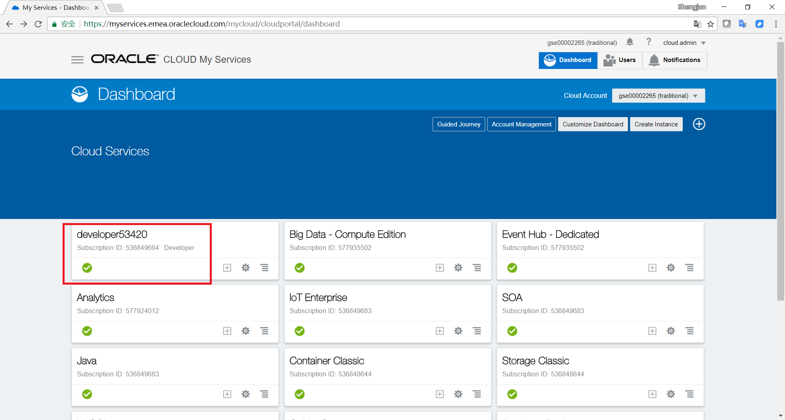

+ Open Service Consoleをクリックする

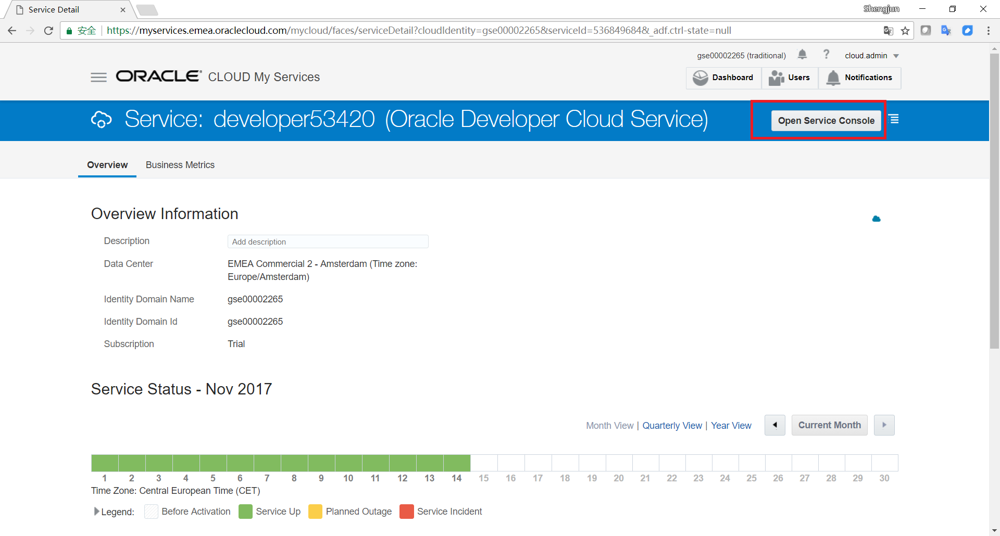

+ ＋New Projectをクリックする

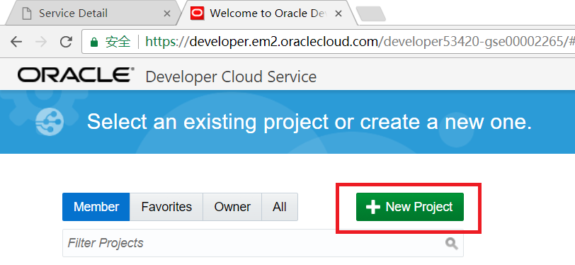

+ Project Detailsの画面で以下の値を入力します。
  - Name: FirstDemo
  - Security: Privateを選択

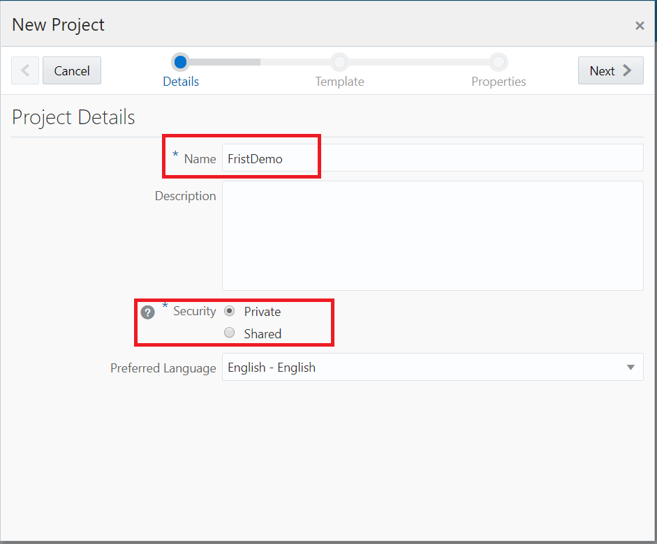

+ Template画面でInitial Repositoryを選択

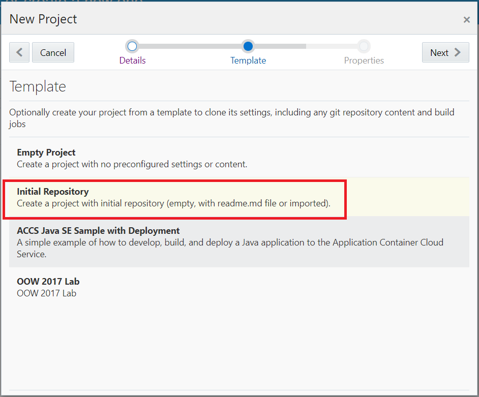

+ Project Properties画面で以下の値を入力し、Finishボタンをクリックする。

  - Wiki Markup: MARKDOWN
  - Initial Repository: Import existing repositoryを選択
  - Repository URL: https://github.com/shtfresh/devcs_demo.git

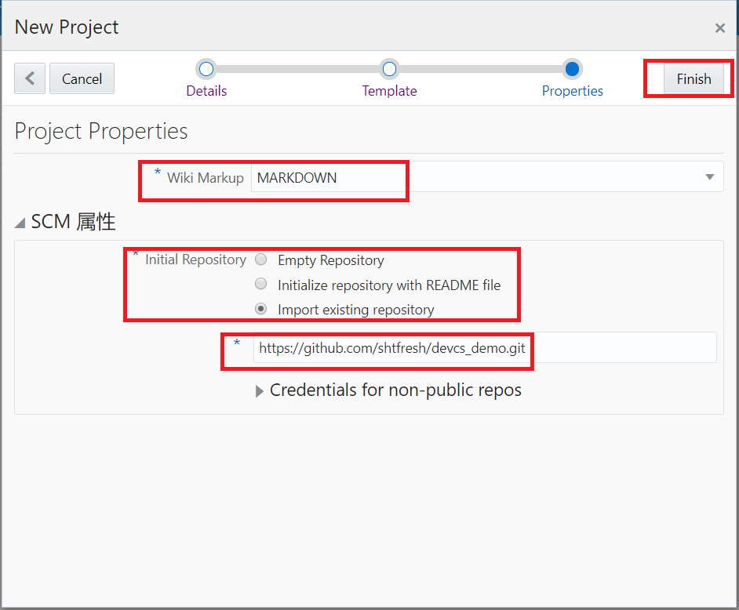

+ **作成後のリソース**

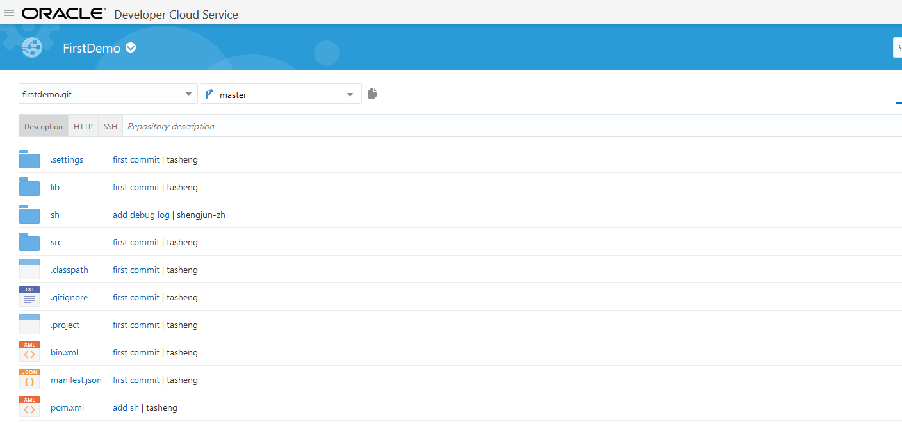

### アプリケーションで使用するデータべースを作成、データ投入

+ **作成したDBCSインスタンスの様子**

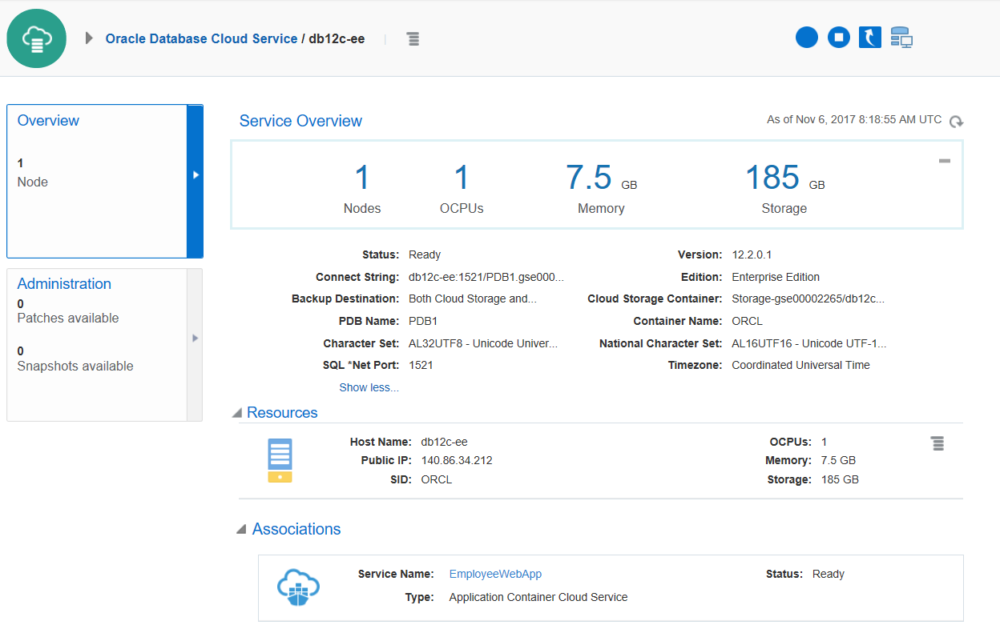

+ **手動で1521 ポートを開放する**

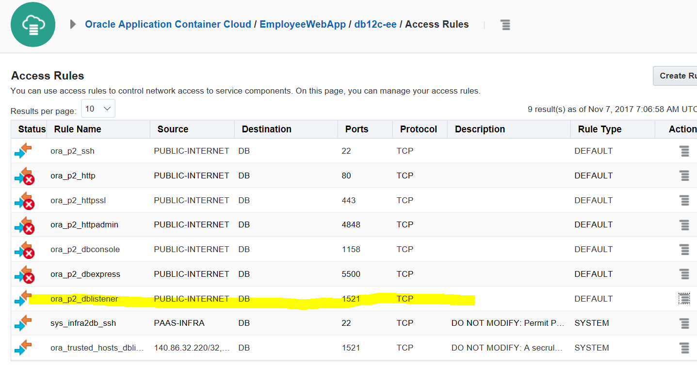

​

+ **SYSユーザを使ってログインする**

  DB接続設定画面で以下の値を入力します。

  - 接続名:DEVCS_DBCS 
  - ユーザ名: SYS
  - パスワード: Pa55_word（作成したDBCSの管理者パスワード）

  - ロール: SYSDBA

  - ホスト名: 140.86.34.212（作成したDBCSのホスト名）
  - ポート: 1521
  - サービス名: PDB1.gse00002265.oraclecloud.internal

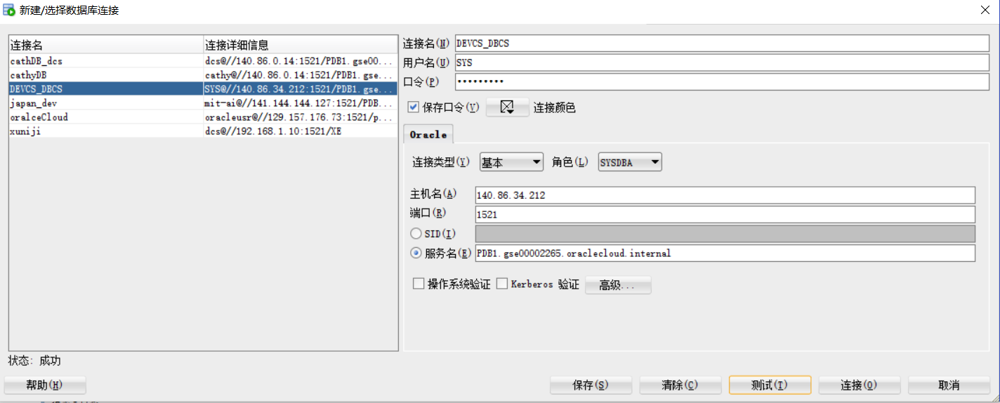

+ **新しいユーザーを作る、権限をあげる。**

  create user oracleusr identified by oracle;
  grant ALTER SESSION, CREATE DATABASE LINK, CREATE MATERIALIZED VIEW, CREATE PROCEDURE, CREATE PUBLIC SYNONYM, CREATE ROLE, CREATE SEQUENCE, CREATE SESSION, CREATE SYNONYM, CREATE TABLE, CREATE TRIGGER, CREATE TYPE, CREATE VIEW, UNLIMITED TABLESPACE to oracleusr;

+ **oracleusrを使って、もう一回ログインする**

  DB接続設定画面で以下の値を入力します。

  - 接続名:DEVCS_DBCS 
  - ユーザ名: oracleusr
  - パスワード: oracle

  - ロール: デフォルト値

  - ホスト名: 140.86.34.212
  - ポート: 1521
  - サービス名: PDB1.gse00002265.oraclecloud.internal

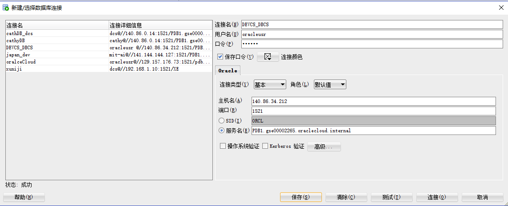

+ **データテーブルを削除するため（存在する場合）、プロシージャ  "CHECKTABLE "を作る**

  create or replace PROCEDURE CHECKTABLE AS 
  v_count number;
  BEGIN
  Select count(1) into v_count from all_tables where TABLE_NAME='EMPLOYEE';
  if v_count > 0 then
  execute immediate 'drop table EMPLOYEE';
  end if;
  END CHECKTABLE;

以上。
